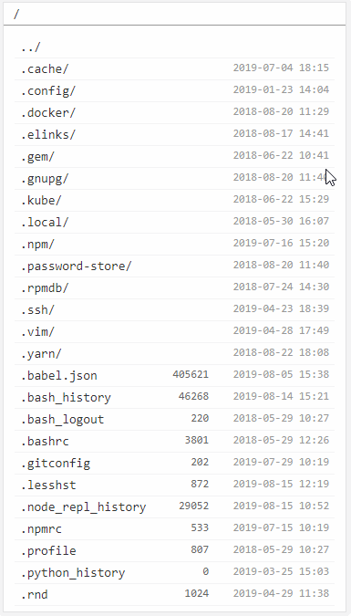

# Go HTTP File Server
Simple command line based HTTP file server to share local file system.



## Features
- More friendly UI than Apache/Nginx directory index page
- Adapt for mobile display
- Single executable file
- Can download the whole contents of current directory as archive file if enabled
- Can upload files to current directory if enabled
- Can specify a custom theme for page rendering
- Support location alias(mount another directory to url location)

## Compile
Minimal required Go version is 1.2.
Ensure this project is located at `GOPATH/src/mjpclab.dev/ghfs`.
```sh
go build main.go
```
Will generate executable file "main" in current directory.

If default html template files under `src/tpl` changed, need to re-embed templates into go files:
```bash
cd src
make tpls
```
Then compile the project like above.

## Examples
Start server on port 8080, root directory is current working  directory:
```sh
ghfs -l 8080
``` 

Start server on port 8080, root directory is /usr/share/doc:
```sh
ghfs -l 8080 -r /usr/share/doc
```

Start server on default port, root directory is /tmp, and allow upload files to file system directory /tmp/data:
```sh
ghfs -r /tmp -u /data
```

Share files from /etc, but also mount /usr/share/doc to url path /doc
```sh
ghfs -r /etc -a :/doc:/usr/share/doc
```

Start server on port 8080, serve for HTTPS protocol
```sh
ghfs -k /path/to/certificate/key -c /path/to/certificate/file -l 8080
```

Do not show hidden unix directories and files that starts with `.`.
Tips: wrap wildcard by quotes to prevent expanding by shell.
```sh
ghfs -H '.*'
```

Show access log on console:
```sh
ghfs -L -
```

Http Basic Auth:
- requires authentication for url /files
- username: user1, password: pass1
- username: user2, password: pass2
```sh
ghfs --auth /files --user user1:pass1 --user-sha1 user2:8be52126a6fde450a7162a3651d589bb51e9579d
```

Start 2 virtual hosts:
- server 1
    - listen on port 80 for http
    - listen on port 443 for https
        - cert file: /cert/server1.pem
        - key file: /cert/server1.key
    - hostname: server1.example.com
    - root directory: /var/www/server1
- server 2
    - listen on port 80 for http
    - listen on port 443 for https
        - cert file: /cert/server2.pem
        - key file: /cert/server2.key
    - hostname: server2.example.com
    - root directory: /var/www/server2
```sh
ghfs --listen-plain 80 --listen-tls 443 -c /cert/server1.pem -k /cert/server1.key --hostname server1.example.com -r /var/www/server1 ,, --listen-plain 80 --listen-tls 443 -c /cert/server2.pem -k /cert/server2.key --hostname server2.example.com -r /var/www/server2
```

## Usage
```
ghfs [options]

-l|--listen <ip|port|:port|ip:port|socket> ...
    IP and port the server listens on, e.g. ":80" or "127.0.0.1:80".
    If --cert and --key are specified, port listens for TLS connection.
    If port is not specified, use "80" for pure HTTP mode, or "443" for TLS mode.
    If value contains "/" then treat it as a unix socket file.
    Flag "-l" or "--listen" can be ommitted.
--listen-plain <ip|port|:port|ip:port|socket> ...
    Similar to --listen, but force to use non-TLS mode
--listen-tls <ip|port|:port|ip:port|socket> ...
    Similar to --listen, but force to use TLS mode, will failed if cert or key is not specified.

--hostname <hostname> ...
    Specify hostname associated with current virtual host.
    If value starts with ".", treat it as a suffix, to match all levels of sub domains. e.g. ".example.com"
    If value ends with ".", treat it as a prefix, to match all levels of suffix domains.

-r|--root <directory>
    Root directory of the server.
    Defaults to current working directory.

-R|--empty-root
    Use virtual empty directory as root directory.
    Useful to share alias directories only.

-a|--alias <separator><url-path><separator><fs-path> ...
    Set path alias.
    Mount a file system path to URL path.
    e.g. ":/doc:/usr/share/doc"

--prefix <path> ...
    Serve files under a specific sub url path.
    Could be useful if server is behind a reverse proxy and
    received the request without proxying path stripped.

-/|--auto-dir-slash [<status-code>=301]
    If a directory list page is requested without tailing "/" in the URL,
    redirect to the URL with the suffix.
    If a file is requested with tailing "/" in the URL,
    redirect to the URL without the suffix.

--default-sort <sortBy>
    Default sort rule for files and directories.
    Available sort key:
    - `n` sort by name ascending
    - `N` sort by name descending
    - `e` sort by type(suffix) ascending
    - `E` sort by type(suffix) descending
    - `s` sort by size ascending
    - `S` sort by size descending
    - `t` sort by modify time ascending
    - `T` sort by modify time descending
    - `_` no sort
    Directory sort:
    - `/<key>` directories before files
    - `<key>/` directories after files
    - `<key>` directories mixed with files

-I|--dir-index <file> ...
    Specify default index file for directory.

--global-restrict-access [<allowed-host> ...]
    Restrict access from third party host for all url paths, by detecting
    request header `Referer` or `Origin`.
    If the request header is empty, directory list page is still allowed
    to access.
    If allowed host is not specified, file content can only be accessed from
    current host. Note this will not help to restrict access from other one
    who point a domain to your host and could be matched to current virtual host,
    unless specify the allowed host explicitly.
    The "host" could be a hostname which means using a default port, or the form
    of "host:port".
--restrict-access <separator><url-path>[<separator><allowed-host>...] ...
    Similar to --global-restrict-access, but for a specific URL path(and sub paths).
    e.g. "#/url/path#example1.com#example2.com".
--restrict-access-dir <separator><fs-path>[<separator><allowed-host>...] ...
    Similar to --global-restrict-access, but for a file system path(and sub paths).
    e.g. "#/fs/path#example1.com#example2.com".

--global-header <name>:<value> ...
    Add custom HTTP response header.
--header <separator><url-path><separator><name><separator><value> ...
    Add custom HTTP response header for a specific URL path(and sub path).
--header-dir <separator><fs-path><separator><name><separator><value> ...
    Similar to --header, but use file system path instead of url path.

-U|--global-upload
    Allow upload files for all url paths.
    Use it with care.
-u|--upload <url-path> ...
    Set url paths(and sub paths) that allows to upload files.
    Use it with care.
--upload-dir <fs-path> ...
    Similar to --upload, but use file system path instead of url path.
    Use it with care.

    Notes for upload options:
        If filename exists and is a regular file,
        will try to remove it first if deleting is enabled(e.g. by --delete),
        otherwise will try to add or increase numeric suffix.
        For directory upload mode, sub directories will be uploaded only if mkdir is enabled.

--global-mkdir
    Allow create sub directory under all url paths.
--mkdir <url-path> ...
    Allow create sub directory under specific url paths(and sub paths).
--mkdir-dir <fs-path> ...
    Similar to --mkdir, but use file system path instead of url path.

    Notes for mkdir options:
        To avoid ambiguity, names shadowed by aliased items cannot be created.

--global-delete
    Allow delete items under all url paths.
--delete <url-path> ...
    Allow delete items under specific url paths(and sub paths).
--delete-dir <fs-path> ...
    Similar to --delete, but use file system path instead of url path.

    Notes for delete options:
        To avoid ambiguity, aliased items under a path cannot be deleted.
        Non-aliased files/directories inside aliased items still can be deleted.
        To avoid ambiguity, files/directories shadowed by aliased items cannot be deleted.

-A|--global-archive
    Allow user to download the whole contents of current directory for all url paths.
    A download link will appear on top part of the page.
    Make sure there is no circular symbol links.
--archive <url-path> ...
    Allow user to download the whole contents of current directory for specific url paths(and sub paths).
--archive-dir <fs-path> ...
    Similar to --archive, but use file system path instead of url path.

--global-cors
    Allow CORS requests for all url path.
--cors <url-path> ...
    Allow CORS requests for specific url paths(and sub paths).
--cors-dir <fs-path> ...
    Allow CORS requests for specific file system paths(and sub paths).

--global-auth
    Use Basic Auth for all url path.
--auth <url-path> ...
    Use Basic Auth for specific url paths(and sub paths).
--auth-dir <fs-path> ...
    Use Basic Auth for specific file system paths(and sub paths).
--user [<username>]:[<password>] ...
    Specify users for current virtual host for Basic Auth, empty username and/or password is allowed.
--user-base64 [<username>]:[<base64-password>] ...
--user-md5 [<username>]:<md5-password> ...
--user-sha1 [<username>]:<sha1-password> ...
--user-sha256 [<username>]:<sha256-password> ...
--user-sha512 [<username>]:<sha512-password> ...
    Specify users for Basic Auth, with encoded password.

-c|--cert <file> ...
    Specify TLS certificate file.

-k|--key <file> ...
    Specify key file of TLS certificate.

--theme <file>
    Specify a zip archive file as custom theme for rendering page and assets, instead of builtin ones.
    Theme contents are cached in memory at runtime.
--theme-dir <directory>
    Specify a directory which contains theme files.
    Theme contents will be evaluated for each request.
    It is convenient for developing themes.

    Notes for theme options:
        --theme and --theme-dir are mutually exclusive.
        --theme-dir is prior.
        Page template filename is always "index.html".
        Use "?asset=<asset-path>" to reference an asset in theme.

--hsts [<max-age>]
    Enable HSTS(HTTP Strict Transport Security).
    Only available if current virtual host listens both plain HTTP and TLS on standard ports.
--to-https [<target-port>]
    Redirect plain HTTP request to HTTPS TLS port.
    Target port must be exists in --listen-tls of current virtual host.
    If target port is omitted, the first item from --listen-tls will be used.

-S|--show <wildcard> ...
-SD|--show-dir <wildcard> ...
-SF|--show-file <wildcard> ...
    If specified, files or directories match wildcards(except hidden by hide option) will be shown. 

-H|--hide <wildcard> ...
-HD|--hide-dir <wildcard> ...
-HF|--hide-file <wildcard> ...
    If specified, files or directories match wildcards will not be shown.

-L|--access-log <file>
    Access log file.
    Set "-" to use stdout.
    Set to empty to disable access log.

-E|--error-log <file>
    Error log file.
    Set "-" to use stderr.
    Set to empty to disable error log.
    Defaults to "-".

--config <file>
    Specify options from external file.

    Its content is option list of any other options,
    same as the form specified on command line,
    separated by whitespace characters.

    The external config's priority is lower than arguments specified on command line.
    If one option is specified on command line, then external config of that option is ignored.

    Set "-" to use stdin.

,,
    To specify multiple virtual hosts with options, split these hosts' options by this sign.
    Options above can be specified for each virtual host.

    If multiple virtual hosts share same IP and ports,
    use --hostname to identify them according to the request.
    If request host name does not match any virtual host,
    server will try to use first virtual host that has no hostname,
    otherwise use the first virtual host.
```

## Environment variables

### GHFS_PID_FILE
Specify PID file path. PID will be written into the file on application startup.

### GHFS_QUIET
To prevent outputting additional information on console, like accessible URLs, etc,
set value to "1".

### GHFS_CPU_PROFILE_FILE
Generate Go's CPU pprof profile to specific file path.

## Shortcut key for default theme
- `←`, `→`: move focus between path items
- `Ctrl`/`Opt` + `←`: move focus to first path item
- `Ctrl`/`Opt` + `→`: move focus to last path item
- `↑`, `↓`: move focus between file items
- `Ctrl`/`Opt` + `↑`: move focus to first file item
- `Ctrl`/`Opt` + `↓`: move focus to last file item
- Repeat inputting same character will look for next file that prefixes with it. + `Shift` for reverse direction.
- Non-repeat inputs will be remembered as a string in short time to look for next file prefix match. + `Shift` for reverse direction.
- When upload is enabled, pasting(`Ctrl`/`Cmd` + `v`) image or text content will upload that content as a file.
